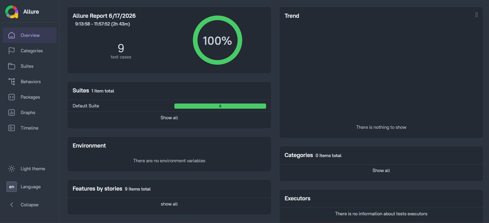

# ⚡ Enterprise API Automation Framework (Java + RestAssured)

[](https://www.oracle.com/java/)
[](https://rest-assured.io/)
[](https://testng.org/)
[](https://allurereport.org/)

## 📝 Project Overview
This is a comprehensive, industry-standard API automation framework designed to test RESTful web services. It uses the **GoRest API** to demonstrate advanced backend testing capabilities, focusing on data integrity, security, and performance.

### 🌟 Key Technical Highlights
- **API Chaining (CRUD Lifecycle):** Successfully automated the full lifecycle of a user entity by passing data between requests (Create -> Retrieve -> Update -> Delete -> Verify).
- **POJO & Serialization:** Used **Jackson Databind** to map JSON payloads to Java Objects (POJOs), ensuring clean and maintainable code.
- **Contract Testing:** Implemented **JSON Schema Validation** to ensure the API responses adhere to predefined data structures.
- **Negative Testing:** Covered edge cases including unauthorized access (401), invalid data (422), and resource not found (404) scenarios.
- **Advanced Reporting:** Integrated **Allure RestAssured Filters** to automatically log and attach every API Request and Response payload for easier debugging.

---

## 🏗️ Project Structure
```text
api-automation-framework-restassured
├── src/main/java
│   └── com.api.framework
│       ├── models       # POJO Classes (User, Post, etc.)
│       └── utils        # ConfigReader and reusable utilities
├── src/test/java
│   └── com.api.framework
│       ├── base         # BaseTest (RequestSpec with Bearer Token)
│       └── tests        # Functional and Negative Test Suites
├── src/test/resources
│   ├── schemas          # JSON Schema files for validation
│   └── config.properties # API Endpoints and Auth Tokens
├── run_api_tests.bat    # One-click execution script
└── pom.xml              # Maven dependencies

```

## 🧪 Test Scenarios Covered

* User Management (CRUD):<br>
    - Create User (POST) with dynamic email generation.
    - Retrieve User details (GET) using ID from previous request.
    - Update User name/status (PATCH).
    - Delete User (DELETE).
    - Verify Deletion (GET - 404).
* Security & Authentication:
    - Unauthorized access check (Invalid/Missing Token).
    - Data Integrity:
    - Email duplication check.
    - Field validation for mandatory attributes.
    - JSON Schema structural verification.

## 📊 Reporting (Allure)
The framework provides deep visibility into API interactions. Every test report includes:

* Request Method & URL
* Request Headers & Body
* Response Status Code & Time
* Full Response JSON Payload

## 🚀 How to Run Locally
Clone the Repo:

Bash

```terminaloutput
git clone https://github.com/chandimananayakkara/api-automation-framework-restassured.git
```
### Configuration:
* Open src/test/resources/config.properties.
* Add your GoRest Access Token.
### 💻 Execution:
Double-click [run_api_tests.bat](C:\Users\Chandima Nanayakkara\Desktop\QA New\api-automation-framework-restassured\api-automation-framework-restassured\run_api_tests.bat) OR run:

Bash

```terminaloutput
mvn clean test
```

View Report:

Bash
```terminaloutput
allure serve allure-results
```
## 📃Test results


<i>👨‍💻 Developed by:</i> Chandima Nanayakkara<br>
Quality Assurance Automation Engineer